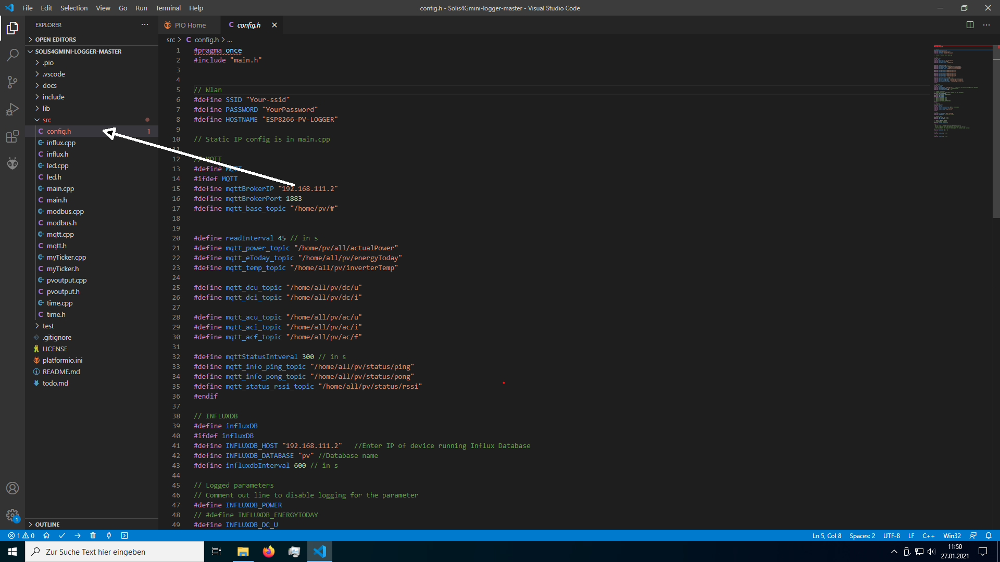
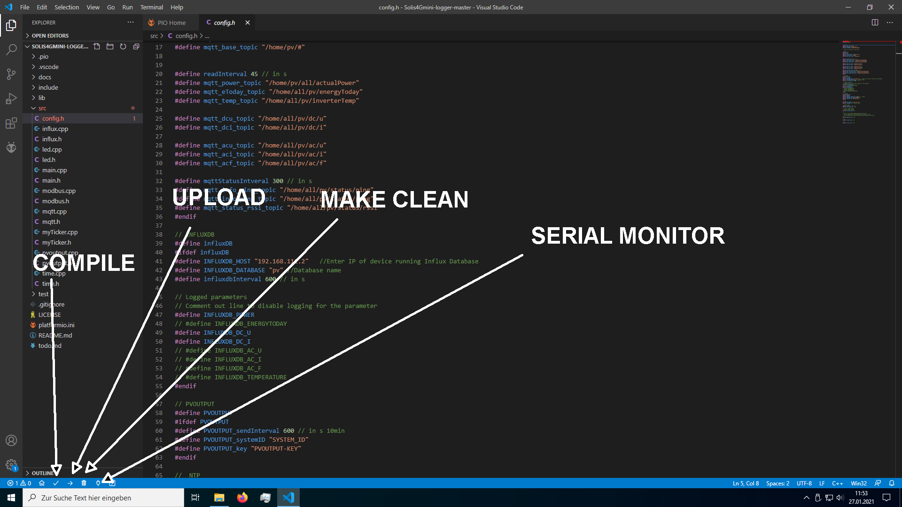

# Detailed compile and upload instructions

0. Install VSCode and platformIO
1. Clone or [download](https://github.com/10k-resistor/Solis4Gmini-logger/archive/master.zip) this repository
2. Rename the file config.h.example to config.h . The file is in the src folder.
3. Open the root folder (the folder with the platformio.ini file.) in VSCode.
4. Press **Ctrl+Shift+e** to open the explorer in VScode. There you open the folder src and open the file config.h . 
5. Change you Wifi-credentials and the hostname in this file. You can set an static IP-address in the main.cpp file. 
6. Configure PVoutput, influxdb and mqtt. If you have no idea what this is, leave the settings as they are.
7. Press the compile button. 
8. After it has finished compiling you upload the code with the upload-button.
9. Get the IP from your ESP and open it in a browser.
10. Connect your ESP8266 to your inverter.

[Home](https://10k-resistor.github.io/Solis4Gmini-logger/)